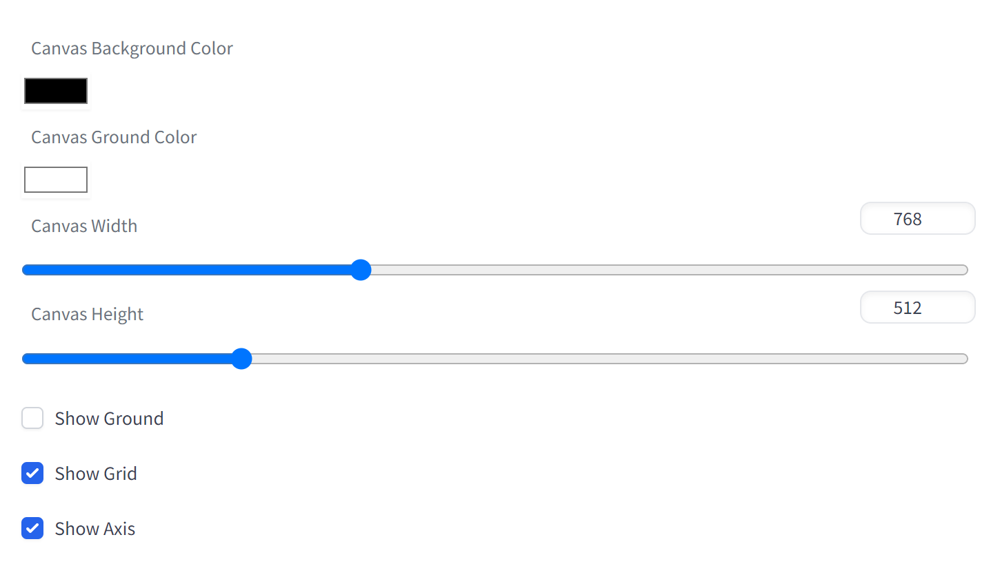
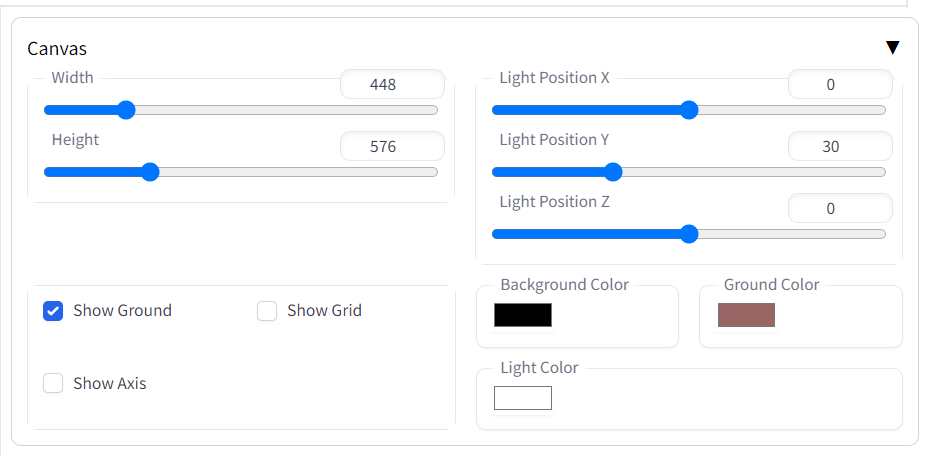
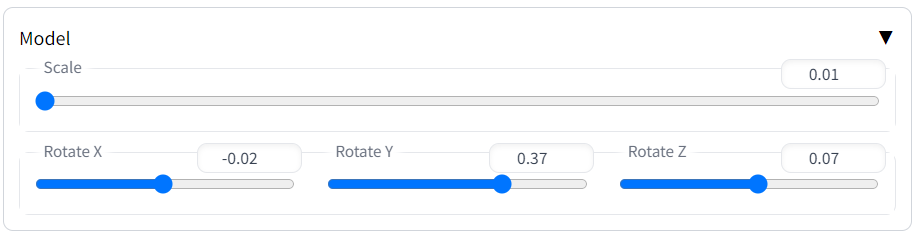
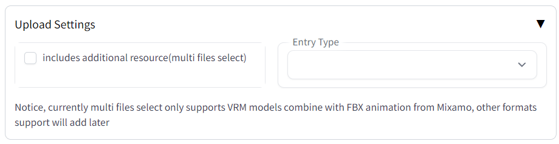
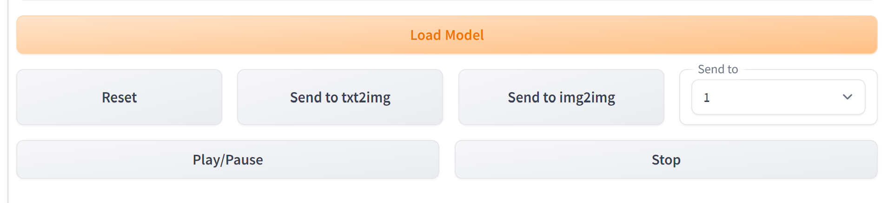

# Stable Diffusion WebUI 3D Model&Pose Loader
A custom extension for [AUTOMATIC1111/stable-diffusion-webui](https://github.com/AUTOMATIC1111/stable-diffusion-webui) that allows you to load your local 3D model/animation inside webui, or edit pose as well, then send screenshot to txt2img or img2img as your ControlNet's reference image.  

## Support formats
Currently, it supports to load several types with two modes.  
**Single File mode**  
By the default, you can upload single file directly, support formats:
1. obj
2. stl
3. fbx
4. glb - partly support, it fails on the model needs draco_decoder (like [IridescentDishWithOlives.glb](https://github.com/mrdoob/three.js/blob/dev/examples/models/gltf/IridescentDishWithOlives.glb)) or KTX2 textures (like [coffeemat.glb](https://github.com/mrdoob/three.js/blob/dev/examples/models/gltf/coffeemat.glb)), need to figure out how to fix later
5. gltf - partly support, it fails on the model has other resources (like [DamagedHelmet.gltf](https://github.com/mrdoob/three.js/tree/dev/examples/models/gltf/DamagedHelmet/glTF)), will fix later in Multi Files mode
6. vrm - more support see Multi File Mode  

**Multi Files mode**  
if you select _includes additional resource(multi files select)_ under Upload Settings, and choose entry type, you can upload multi files once time, support formats:
1. vrm - this extension supports vrm format combines with FBX animation from [Mixamo](https://www.mixamo.com/#/).

Right now Multi Files mode only support vrm, more formats suport will add later.

But it has potential to support more, since threejs does.
So if you want other formats such as cmt, just feel free to open an issue, I will add it later.  
(I upload two models, **male02.obj** and **Sanba Dancing.fbx**, as your test, you can find them under **/models** folder)

## Pose support
Even there are several extension for webui to edit pose, such as [openpose-editor](https://github.com/fkunn1326/openpose-editor), [posex](https://github.com/hnmr293/posex), [3d-open-pose-editor](https://github.com/nonnonstop/sd-webui-3d-open-pose-editor), but almost of them are implemented with openpose.  
I want to provide you alternative solution to do so in this extension (this is the reason I changed the name to **3D Model/Pose Loader**).  
In the pose panel, if you don't have vrm model, you can just click **Load Pose Model** to load the embedded model, and use **Save Pose as Json** or **Load Pose from Json** to restore your work.  

I would like to implement some default poses later in a pose library.

## Installation
Just like you install other extension of webui:
1. go to Extensions -> Install from URL
2. paste this repo link
3. install
4. go to Installed, apply and restart UI

Or you can install from Extensions -> Available, and load the official extension link, then you can find this extension on the list.

## Settings
Right there are some configurations under Settings -> 3D Model:
1. Canvas Background Color
2. Canvas ground Color
3. Canvas Width
4. Canvas Height
5. Show Ground
6. Show Grid
7. Show Axis

After you change any configurations, do not **only** Apply Settings, you also need to go Extensions then click Apply and restart UI to make the settings effect.

## Settings from page
You can also configure the canvas, model or animation from the main tab page, the default values would read from settings, but no need to reload if configured here.
There are 5 panels and several buttons on the page:
1. Pose - allow you to edit pose basing on embedded vrm model. 
2. Canvas - control the canvas properties, such as width, height, light position, color and so on. 
3. Model - scale or rotate the model. 
4. Upload Settings - set multi file support along with entry type up here, see Support Format section. 
5. Animation - control the FBX animation playing with progress bar here. 

there are several buttons on the page:
1. **Upload Model** -> upload your 3D model file
2. **Reset** -> reset the camera to default position and remove all uploaded objects (There are some issues on this feature, I will fix soon)
3. **Send to txt2img** -> Send the current view of the 3D model on ControlNet in txt2img 
4. **Send to img2img** -> Send the current view of the 3D model on ControlNet in img2img
5. **Send to** -> If you have multi ControlNet, you can select the one you want to send

## Operation
On the main tab of 3D Model Loader, you can use:
1. **Mouse left button** -> rotate the camera
2. **Mouse wheel** -> zoom in or out
3. **Mouse right button** -> move the camera

## Gradio.Model3D?
I know gradio has its own 3D model component called **Gradio.Model3D**, but it only supports three formats: obj, glb and gltf, I think it is not enough, at least it should support FBX animation, so I build my own extension.

## Further Plan
Even ThreeJS has superpower to do huge graphic works, such as Light, Texture, and so on.  
However I don't want to rebuild a C4D or Blender inside stable diffusion webui (Actually ThreeJS already has it, called **editor** see [here](https://threejs.org/editor/))
Thus this extension will focus on user experience to give you better reference image from your 3D Model.

## Credits
Created by [jtydhr88](https://github.com/jtydhr88) and special thanks to other contributors:
- [missionfloyd](https://github.com/missionfloyd)
- [chucktobbes](https://github.com/chucktobbes)
- Everyone who gives feedback

## My other extension for Stable diffusion webui
- [Canvas Editor](https://github.com/jtydhr88/sd-canvas-editor) A custom extension for AUTOMATIC1111/stable-diffusion-webui that integrated a full capability canvas editor which you can use layer, text, image, elements and so on, then send to ControlNet, basing on Polotno.
