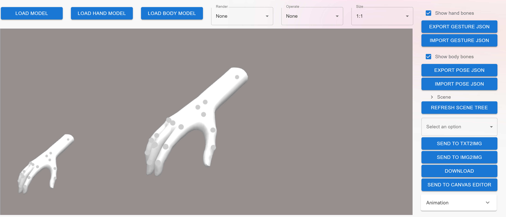
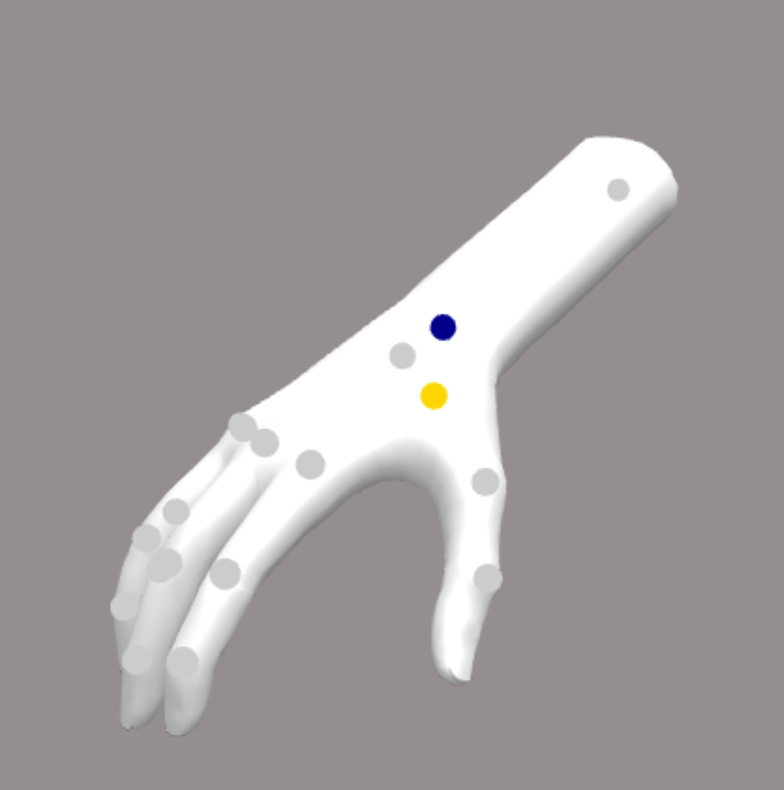
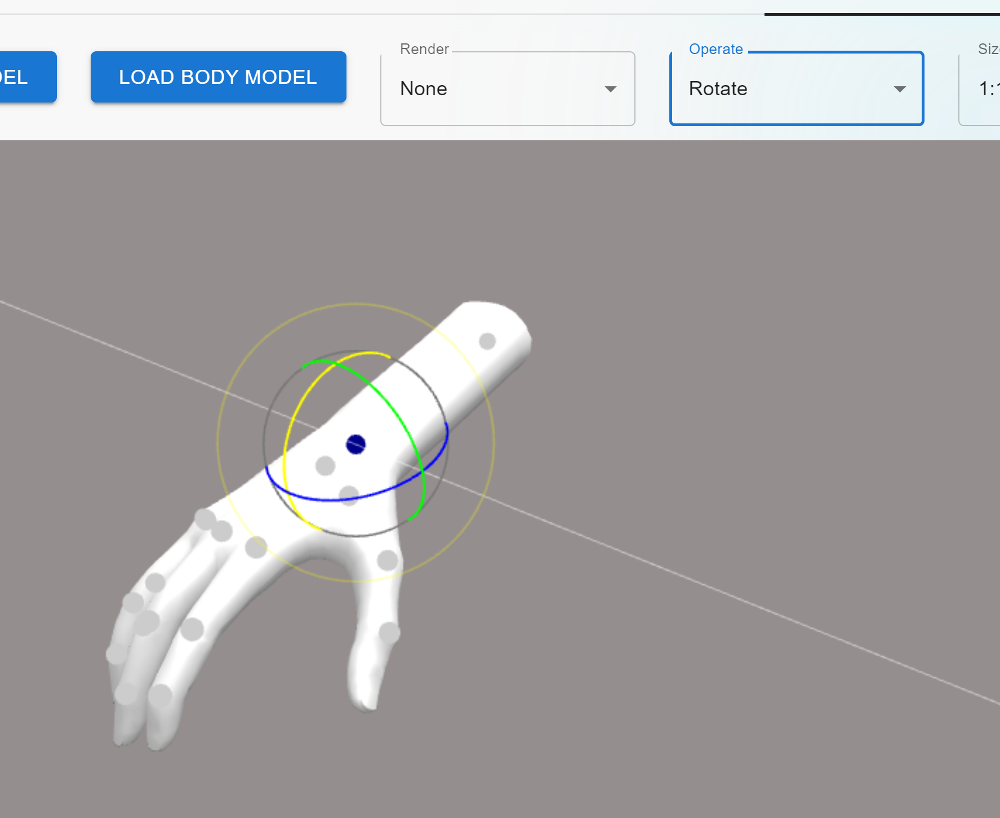
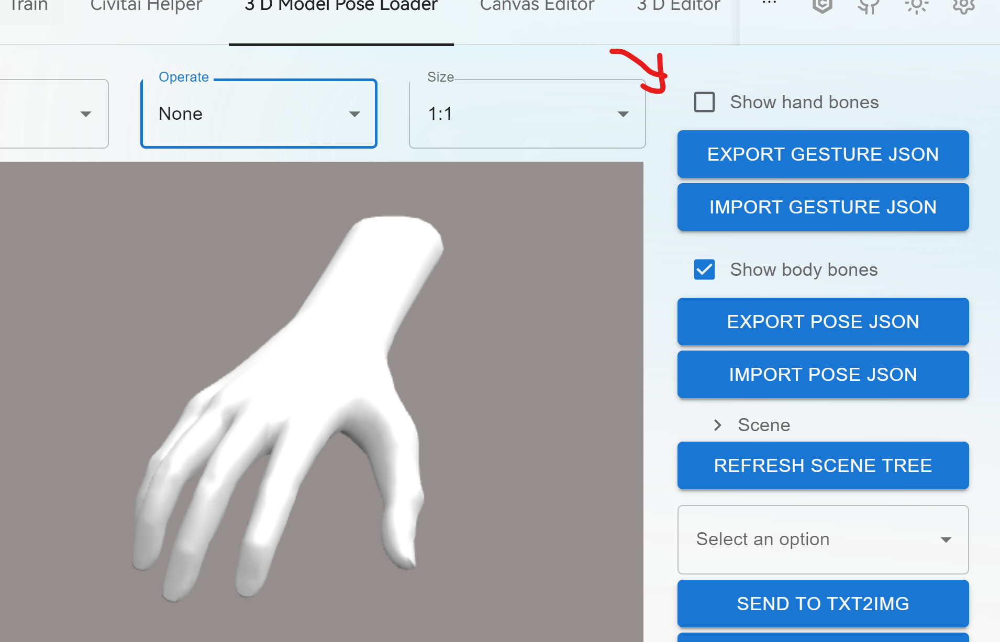
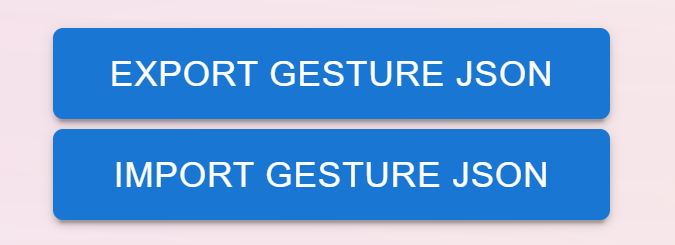

# Hand model & gesture edit

you can click **LOAD HAND MODEL** to load the embedded model to edit gesture.

Then click the bone points on the hand to choose the bone.

Yellow means hover on the bone and blue means select the the bone.

Next, choose **Rotate** from **Operate**, the rotate bar will show up.

Edit gesture until what you want.

you can check/uncheck **show hand bones** checkbox.

Use **Export/Import Gesture JSON** button to save and reload your work.
