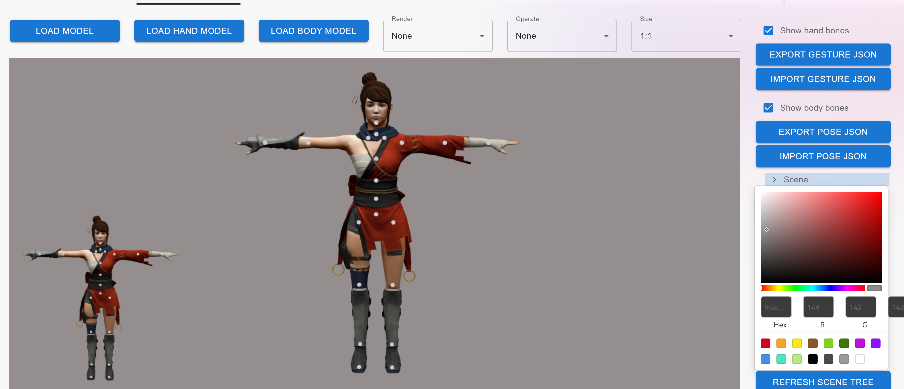
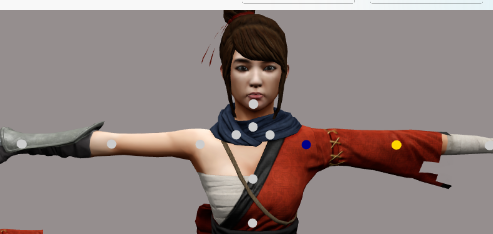
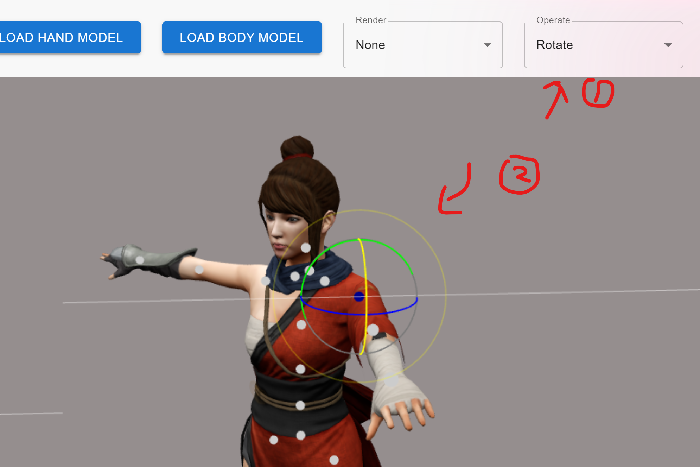
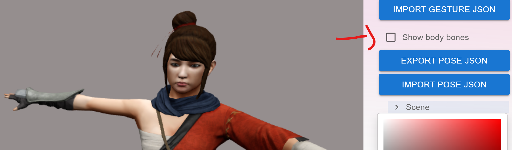
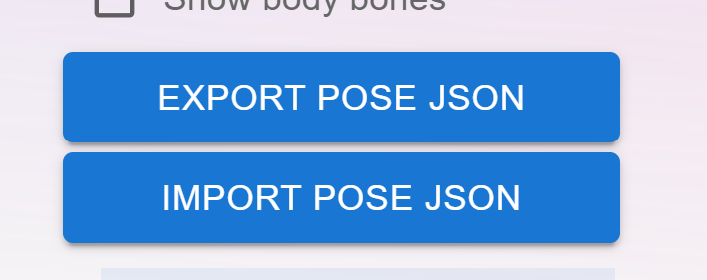

# Pose support
you can click **LOAD BODY MODEL** to load the embedded model edit pose.

Then choose the bone points on the body to choose the bone.

Yellow means hover on the bone and blue means select the the bone.

Next, choose **Rotate** from **Operate**, the rotate bar will show up.

Edit until what you want.

you can check/uncheck **show body bones** checkbox.

Use **Export/Import Pose JSON** button to save and reload your work.
