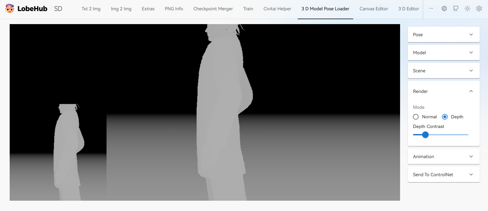
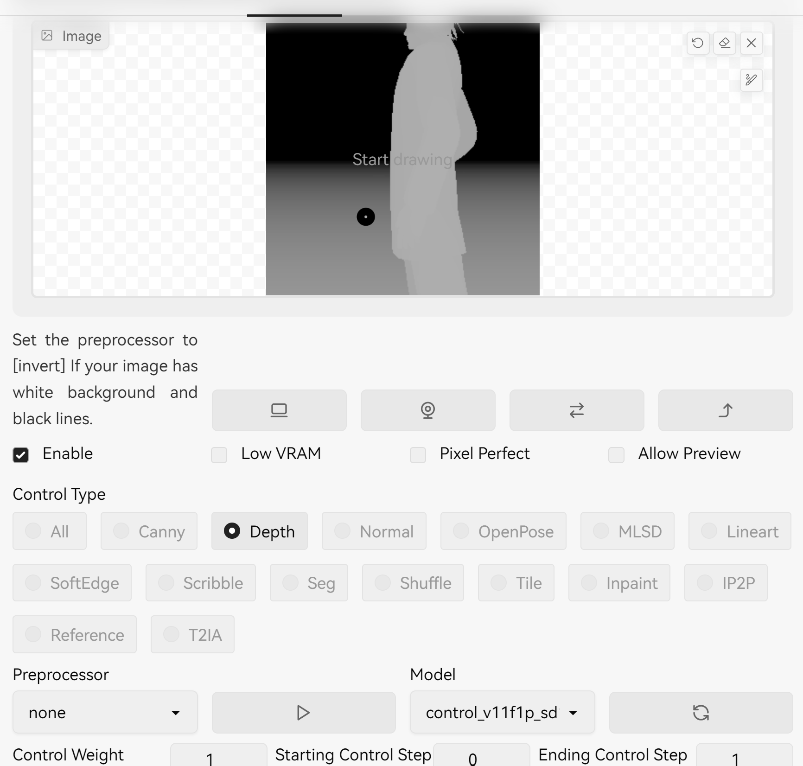
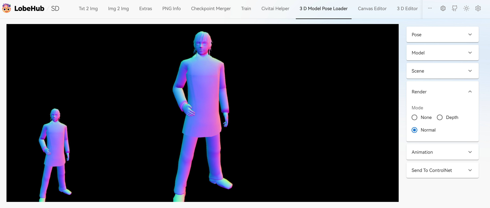
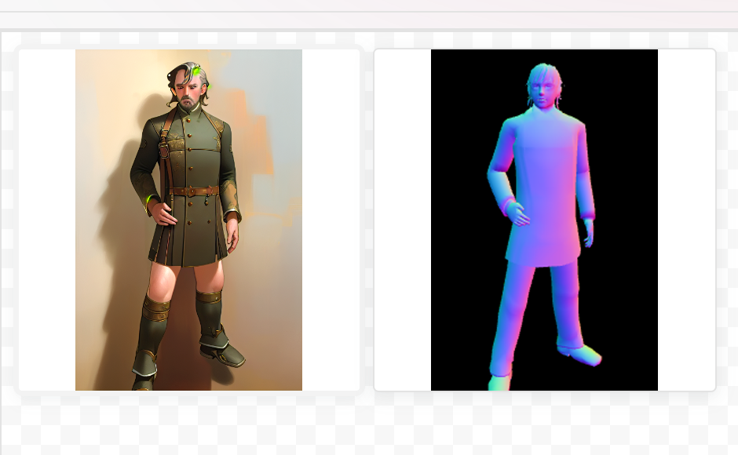

# Render Mode
Right now it supports generate **depth** directly from 3D model:

## Depth Mode
1. upload model (or use embedded hand or body model) and choose Render -> Depth 
2. you can control the contract.
3. Send to ControlNet, and choose **Depth**, choose **none** as Preprocessor
4. generate

## Normal Mode
1. upload model (or use embedded hand or body model) and choose Render -> Normal 
2. Send to ControlNet, and choose **Normal**, choose **none** as Preprocessor
3. generate