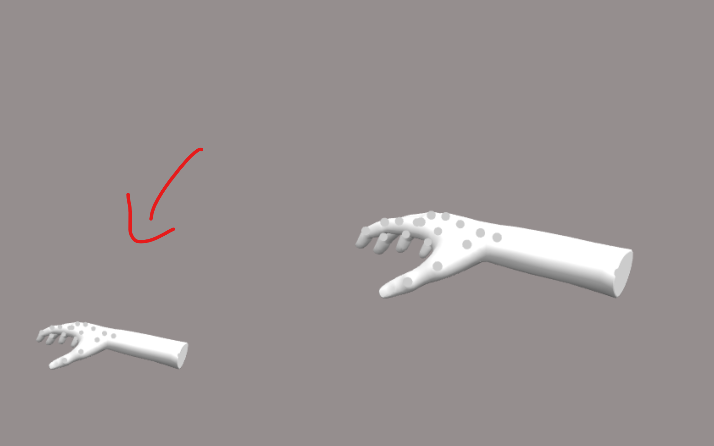
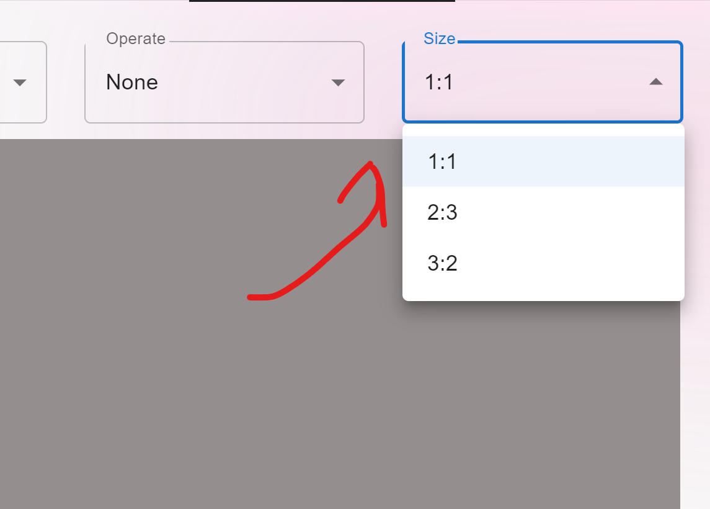
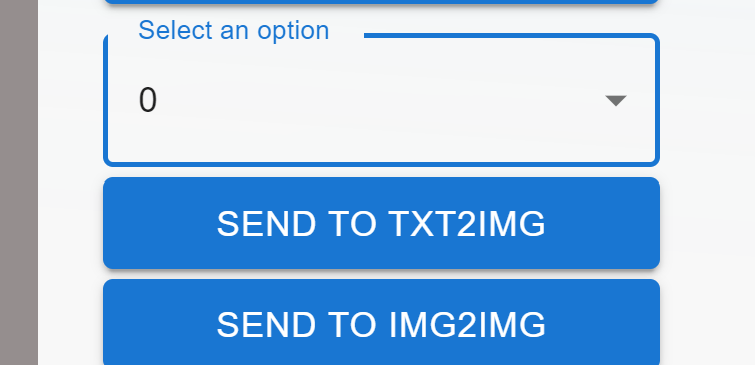
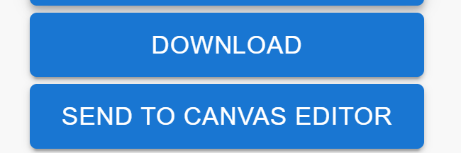

# Send To

There are several ways to use your working image.  
First of all, the extension would not use the whole canvas, it will output the small screen on the bottom left corner.

it has 3 size: 1:1, 2:3 and 3:2 which can control from:

Once you complete uploaded model, edit pose/gesture, you can send to ControlNet of txt2img/img2img. (I know there are some bugs here, will fix soon)

Or you can download the image directly by clicking **DOWNLOAD** button.

If you installed my other extension, [Canvas Editor](https://github.com/jtydhr88/sd-canvas-editor), you can send the image to it to do some further work:

