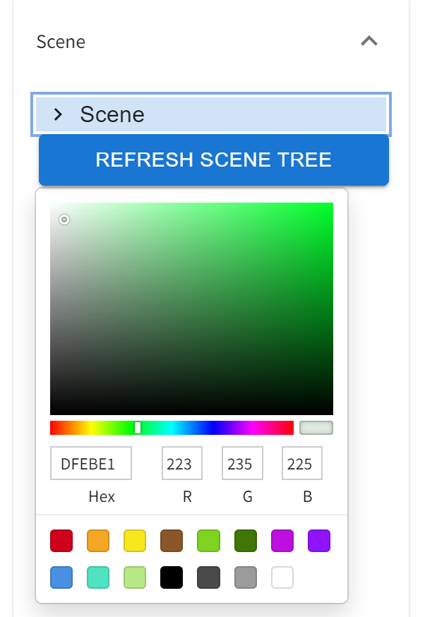
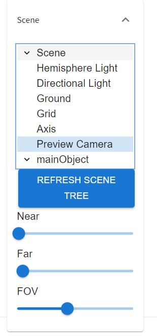

# Settings
Do not use configurations under Settings -> 3D Model, it would not work.  
I will remove them later.

## Settings from page
There are 4 panels and several buttons on the page:
1. Model - allow you to load your local 3d model file.
2. Scene - control the canvas properties, list the objects in the scene
   1. click **Refresh Scene Tree** if there is nothing
   2. click **Scene** - to show up background color picker  
   
   3. **visible checkbox** is available on _Directional Light_, _Ground_, _Grid_, _Axis_ and _mainObject_, you use it to show objects up or not   
   
   4. **Operate radio button** is available on _Directional Light_, _Hemisphere Light_, and _mainObject_, you use it to translate or rotate object from scene (in fact, I will use this to rebuild pose editor later)   
    
   5. click **Preview Camera** - show up Near, Far and FOV for camera   
   
3. Animation - control the FBX animation playing with progress bar here.   

4. Send To ControlNet - Send the current preview view of the 3D model on ControlNet in txt2img or img2img   
