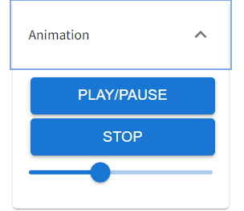

# Settings from page
There are some panels and several buttons on the page:
2. Scene - control the canvas properties, list the objects in the scene
   1. click **Refresh Scene Tree** if there is nothing
   2. click **Scene** - to show up background color picker  
   
   3. **visible checkbox** is available on _Directional Light_, _Ground_, _Grid_, _Axis_ and _mainObject_, you use it to show objects up or not   
   
   5. click **Preview Camera** - show up Near, Far and FOV for camera   
   
3. Animation - control the FBX animation playing with progress bar here.   
